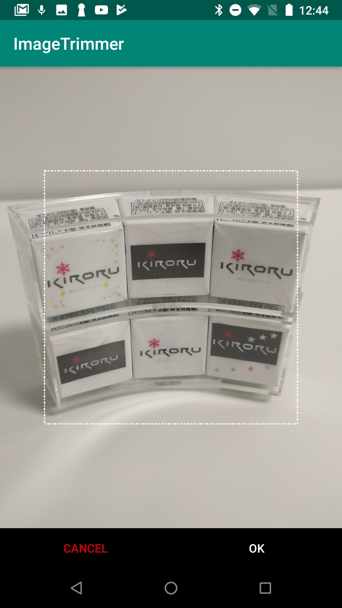

# ImageTrimmer for Android

ImageTrimmer provides a screen to cut the image to be edited into a square.

## Screenshots



## Example

This is a sample to get an image from a camera or gallery app and crop it with this library.   
You can execute the sample in the following procedure.

1. Get this repository locally with `git clone`.
2. Open the project in `Android Studio` and execute the `sample` module.

## Installation

Add the following description to build.gradle under the app directory.  
After adding, run gradle sync.

```Ruby
repositories {
    maven {
        url 'https://kiroru.github.io/maven/repository'
    }
}

dependencies {
    ..(other dependencies)..
    implementation 'jp.kiroru:imagetrimmer:1.0.1'
}
```

## Basic Usage

This is an example of trimming the example.jpg below drawable.

To open the trimming activity, Uri of the input image and File of the result output destination are required.

```Kotlin
fun show() {
    // Prepare Uri of the target image.
    val srcUri = Uri.parse("android.resource://jp.kiroru.exmaple/drawable/example")

    // Prepare a storage location for the result image.
    dstFile = File(filesDir, "trimming.jpg")

    // Create a save destination file.
    if (!dstFile.exists()) dstFile.createNewFile()

    // Generate Intent and open the trimming activity.
    val intent = ImageTrimmerActivity.createIntent(this, srcUri, dstFile)
    startActivityForResult(intent, REQUEST_CODE)
}
```

Receive the completion of processing with onActivityResult, and obtain an image from the file path of the output image.

```Kotlin
override fun onActivityResult(requestCode: Int, resultCode: Int, data: Intent?) {
    when (requestCode) {
        REQUEST_CODE -> {
            if (resultCode == Activity.RESULT_OK) {
                val image = BitmapFactory.decodeFile(dstFile.absolutePath)
                imageView.setImageBitmap(image)
            }
        }
    }
}
```

## License

ImageTrimmer is available under the MIT license. See the LICENSE file for more info.
